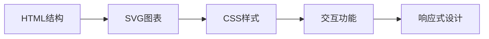

## 今日热点

AI代理工具和专业领域AI应用主导今日热榜，开发者积极构建增强型AI助手和跨平台解决方案，同时关注开发体验优化和健康生产力工具。

---

## 热门项目一览

| 排名 | 项目 | 语言 | 今日 | 总计 | 简介 |
|:---:|------|:----:|------:|-----:|------|
| 1 | [morluto/rea](https://github.com/morluto/rea) | TypeScript | +2,956 | 9,907 | Reverse engineer anything w... |
| 2 | [tester-army/e2e](https://github.com/tester-army/e2e) | TypeScript | +1,725 | 6,469 | Next generation e2e testing... |
| 3 | [DuarteSantos8/openGym](https://github.com/DuarteSantos8/openGym) | JavaScript | +1,419 | 5,833 | Self-hosted gym & body-weig... |
| 4 | [boykopovar/AnyPS5](https://github.com/boykopovar/AnyPS5) | C++ | +949 | 6,768 | Tool for automatic PS5 exec... |
| 5 | [mattpocock/skills](https://github.com/mattpocock/skills) | Shell | +889 | 278,264 | Skills for Real Engineers. ... |
| 6 | [msitarzewski/agency-agents](https://github.com/msitarzewski/agency-agents) | Shell | +623 | 157,887 | A complete AI agency at you... |
| 7 | [earthtojake/text-to-cad](https://github.com/earthtojake/text-to-cad) | Python | +619 | 18,043 | Give your agent CAD superpo... |
| 8 | [pbakaus/impeccable](https://github.com/pbakaus/impeccable) | JavaScript | +616 | 77,767 | The design language that ma... |
| 9 | [thedotmack/claude-mem](https://github.com/thedotmack/claude-mem) | TypeScript | +534 | 97,236 | Persistent Context Across S... |
| 10 | [ayghri/i-have-adhd](https://github.com/ayghri/i-have-adhd) | Python | +326 | 54,480 | A skill to stop your coding... |
| 11 | [cathrynlavery/diagram-design](https://github.com/cathrynlavery/diagram-design) | HTML | +228 | 44,118 | Editorial diagram design fo... |
| 12 | [deepseek-ai/DeepGEMM](https://github.com/deepseek-ai/DeepGEMM) | Cuda | +199 | 8,741 | DeepGEMM: clean and efficie... |

---

## 趋势洞察

```
┌─────────────────────────────────────────────────────────────────┐
│  AI/ML 工具         ████████████████████████  10 个项目        │
│  开发框架             ██                        1 个项目        │
│  开发工具             ██                        1 个项目        │
└─────────────────────────────────────────────────────────────────┘
```

---

## 项目深度解读

### 1. morluto/rea — 全能逆向平台

> **一句话总结**：基于AI代理的自动化逆向工程框架，可处理从应用到原生二进制文件的深度分析。

#### 价值主张

| 维度 | 说明 |
|------|------|
| **解决痛点** | 统一解决多类型逆向工程难题，无需切换多种专业工具 |
| **目标用户** | 安全研究员、逆向工程师、恶意软件分析师 |
| **核心亮点** | AI代理驱动 + 全栈逆向支持 + 自动化分析流程 + 可扩展架构 |

#### 技术架构


**技术特色**：
- 基于TypeScript构建，提供类型安全和良好的开发体验
- 模块化代理架构，支持不同类型的逆向任务
- 统一的数据处理流程，兼容多种文件格式和平台

#### 热度分析

- 项目近期获得大量关注，单日增长近3000 stars，显示其在安全社区引起强烈共鸣
- 相对较低的fork数量表明项目可能仍处于早期阶段，用户更多以观望为主

#### 快速上手

```bash
# 安装rea
npm install -g rea

# 对目标文件进行逆向分析
rea analyze /path/to/target

# 启动交互式代理模式
rea interactive
```

#### 注意事项

- 项目许可证未知，商业使用前需确认授权条款
- 逆向工程可能涉及法律风险，需确保在合法范围内使用
- 项目尚处于快速发展阶段，API可能不稳定


### 2. tester-army/e2e — [新一代e2e]

> **一句话总结**：专为Web和移动应用打造的下一代端到端测试框架，提供更高效、更可靠的测试解决方案。

#### 价值主张

| 维度 | 说明 |
|------|------|
| **解决痛点** | 传统e2e测试框架的复杂性和低效率问题 |
| **目标用户** | Web和移动应用开发团队，QA工程师 |
| **核心亮点** | 简化测试编写 + 提高执行速度 + 增强测试稳定性 + 跨平台支持 |

#### 技术架构


**技术特色**：
- 基于TypeScript，提供类型安全的测试编写体验
- 智能等待机制，减少测试中的不稳定因素
- 并行执行能力，提高测试效率

#### 热度分析

- 项目获得6,469个Star，单日增长1,725，表明项目具有高关注度
- Fork数相对较少，说明项目可能处于早期发展阶段，尚未形成广泛分支

#### 快速上手

```bash
# 安装测试框架
npm install -g tester-army/e2e

# 初始化项目
e2e init my-project

# 运行测试
e2e run
```

#### 注意事项

- 项目目前可能处于快速迭代阶段，API可能会有变化
- 需要关注项目的许可证信息，确保合规使用
- 由于是较新的项目，社区文档和示例可能还不够丰富


### 3. DuarteSantos8/openGym — 自托管健身追踪器

> **一句话总结**：自托管健身应用，支持训练计划、肌肉分析和多平台数据导入，保障用户数据隐私。

#### 价值主张

| 维度 | 说明 |
|------|------|
| **解决痛点** | 解决健身数据隐私问题，提供完全可控的健身追踪平台 |
| **目标用户** | 注重数据隐私的健身爱好者、专业健身人士 |
| **核心亮点** | 自托管部署 + 肌肉状态分析 + 多应用数据导入 + 密钥登录 |

#### 技术架构


**技术特色**：
- 前后端分离架构，便于维护和扩展
- 支持多种健身应用数据导入，兼容性强
- 肌肉状态追踪算法，科学分析训练效果

#### 热度分析

- 项目Star数快速增长，近期增加1,419，表明用户对自托管健身解决方案需求旺盛
- Fork数适中，显示项目具有一定社区参与度和二次开发潜力

#### 快速上手

```bash
# 克隆项目
git clone https://github.com/DuarteSantos8/openGym.git

# 安装依赖
npm install

# 启动开发服务器
npm run dev
```

#### 注意事项

- 项目License未知，使用前需确认授权条款
- 自托管部署需要一定的技术基础，非技术人员可能面临部署挑战
- 项目无Open Issues，可能意味着问题处理迅速，但也可能社区参与度有限


### 4. boykopovar/AnyPS5 — PS5移植工具

> **一句话总结**：一款自动化将PS5游戏可执行文件移植到Windows和Linux平台的工具，打破主机与PC间的壁垒。

#### 价值主张

| 维度 | 说明 |
|------|------|
| **解决痛点** | 解决PS5游戏无法在PC平台运行的限制，扩展游戏可玩性 |
| **目标用户** | 游戏爱好者、PC玩家、独立开发者 |
| **核心亮点** | 自动化逆向分析 + 二进制转换 + 跨平台兼容 + 保持原性能 |

#### 技术架构


**技术特色**：
- 利用C++高效处理PS5特有的架构和指令集
- 智能识别和转换系统调用与图形API
- 构建轻量级兼容层维持游戏性能

#### 热度分析

- 项目近期Star数激增，单日新增近千Star，显示社区高度关注
- 零Issues表明项目处于稳定开发阶段，Fork数显示开发者积极参与

#### 快速上手

```bash
# 克隆仓库
git clone https://github.com/boykopovar/AnyPS5.git

# 构建项目
cd AnyPS5 && mkdir build && cd build && cmake .. && make

# 执行移植
./anyps5 /path/to/ps5/game
```

#### 注意事项

- 该工具可能涉及版权和法律问题，请确保你有权使用和转换相关游戏
- 项目许可证未知，使用前需确认合规性
- PS5架构复杂，部分游戏可能存在兼容性问题


### 5. mattpocock/skills — 工程师技能集

> **一句话总结**：一个包含实用Shell脚本的工程师技能集合，提高开发效率和工作流程。

#### 价值主张

| 维度 | 说明 |
|------|------|
| **解决痛点** | 提供可直接使用的Shell脚本，简化常见工程任务 |
| **目标用户** | 开发人员、系统管理员、DevOps工程师 |
| **核心亮点** | 实用性强 + 即插即用 + 持续更新 + 精选最佳实践 |

#### 技术架构


**技术特色**：
- 纯Shell实现，跨平台兼容性好
- 模块化设计，便于按需使用
- 轻量级，无需额外依赖

#### 热度分析

- 高星高fork项目，日增近千星，表明工程师社区认可度高
- 零开放问题，说明项目维护成熟，用户反馈渠道可能通过其他方式处理

#### 快速上手

```bash
# 克隆仓库
git clone https://github.com/mattpocock/skills.git

# 进入目录并查看可用脚本
cd skills && ls -la
```

#### 注意事项

- 需要基本的Shell知识才能理解和使用脚本
- 使用前应检查脚本是否符合当前环境需求
- 建议先在测试环境验证脚本功能


### 6. msitarzewski/agency-agents — AI代理工厂

> **一句话总结**：提供多样化专业AI代理脚本，一键部署各类数字助手。

#### 价值主张

| 维度 | 说明 |
|------|------|
| **解决痛点** | 单一AI工具无法满足多样化专业需求的困境 |
| **目标用户** | 开发者、内容创作者、数字营销人员 |
| **核心亮点** | 多样化专业代理 + 个性化工作流 + 即插即用部署 + 开源免费 + 无需配置 |

#### 技术架构


**技术特色**：
- 基于Shell脚本实现，跨平台兼容性强
- 模块化设计，每个代理独立运行
- 轻量级架构，资源占用少
- 通过命令行交互，操作简单直观

#### 热度分析

- 项目获得15万+高星，日均增长600+，表明市场对AI代理工具有极高需求
- 2.5万+ Fork数显示开发者社区积极参与二次开发和贡献

#### 快速上手

```bash
# 克隆项目
git clone https://github.com/msitarzewski/agency-agents.git
# 进入目录
cd agency-agents
# 列出可用代理
ls agents/
# 运行特定代理
./agents/frontend-wizard.sh
```

#### 注意事项

- 需要确保系统已安装必要的依赖（如curl, jq等）
- 部分代理可能需要API密钥或付费订阅
- Shell脚本执行权限需要正确设置
- 建议在使用前检查脚本安全性


### 7. earthtojake/text-to-cad — 文本转CAD

> **一句话总结**：通过自然语言描述直接生成CAD模型，降低专业设计门槛。

#### 价值主张

| 维度 | 说明 |
|------|------|
| **解决痛点** | 将复杂CAD设计流程简化为文本描述，无需专业CAD技能 |
| **目标用户** | 非专业设计师、工程师、快速原型开发者 |
| **核心亮点** | 自然语言输入 + 自动CAD生成 + 跨平台支持 + 开源可定制 |

#### 技术架构


**技术特色**：
- 基于大语言模型的设计意图理解
- 参数化CAD模型自动生成
- 支持多种CAD格式输出

#### 热度分析

- 近期Star增长迅速，日均新增300+，显示项目正处于爆发期
- 高关注度且无公开问题，表明项目成熟度较高且社区反馈渠道可能非公开

#### 快速上手

```bash
# 安装依赖
pip install -r requirements.txt

# 运行示例
python text_to_cad.py "创建一个边长为5cm的立方体"
```

#### 注意事项

- 项目可能需要专业CAD知识来优化输出结果
- 复杂设计可能需要多次迭代和提示词调整
- 需要确认开源许可证的具体条款再用于商业项目


### 8. pbakaus/impeccable — AI设计语言

> **一句话总结**：一种提升AI工具设计表现力的前端设计系统，优化人机交互体验。

#### 价值主张

| 维度 | 说明 |
|------|------|
| **解决痛点** | AI工具设计表现不佳，缺乏统一视觉语言 |
| **目标用户** | AI应用开发者、UI设计师、产品经理 |
| **核心亮点** | 组件化设计系统 + AI交互优化 + 响应式布局 |

#### 技术架构


**技术特色**：
- 基于JavaScript的轻量级设计系统
- 专为AI应用优化的组件设计
- 模块化架构支持快速集成

#### 热度分析

- 项目获得77k+高星且持续增长，表明AI设计领域需求旺盛
- Fork数适中，表明项目以使用为主，社区贡献相对有限

#### 快速上手

```bash
# 安装设计语言库
npm install impeccable

# 在项目中引入
import { Button, Card, Layout } from 'impeccable';

# 使用组件
<Button variant="primary">AI增强按钮</Button>
```

#### 注意事项

- 项目许可证未知，商业使用前需确认授权方式
- 项目Open Issues为0，可能意味着问题通过其他渠道处理
- 作为设计语言，需要一定的前端基础才能充分利用


### 9. thedotmack/claude-mem — AI记忆持久化

> **一句话总结**：为AI助手提供跨会话持久化记忆，自动捕获并压缩上下文，增强未来会话相关性

#### 价值主张

| 维度 | 说明 |
|------|------|
| **解决痛点** | AI助手无法记住跨会话交互历史，导致上下文丢失和效率降低 |
| **目标用户** | 频繁使用AI编程助手的专业开发者和技术人员 |
| **核心亮点** | 自动捕获会话数据 + AI压缩技术 + 多平台兼容 + 上下文注入 |

#### 技术架构


**技术特色**：
- 使用AI技术压缩和优化会话数据，减少存储空间占用
- 支持多种主流AI编程助手，提供通用解决方案
- 实现跨会话上下文持久化，增强AI助手连续性

#### 热度分析

- 项目Star数高达97,236且持续增长(+534 today)，表明技术需求旺盛
- Fork数8,566反映社区积极参与和二次开发意愿强烈
- Open Issues为0，说明项目维护良好，用户问题得到及时解决

#### 快速上手

```bash
# 克隆仓库
git clone https://github.com/thedotmack/claude-mem.git
# 安装依赖
npm install
# 配置环境变量
cp .env.example .env
```

#### 注意事项

- 项目License未知，使用时需注意商业应用限制
- 需要考虑数据隐私和安全问题，特别是存储AI交互内容
- 可能需要API密钥或订阅特定AI服务才能发挥完整功能


### 10. ayghri/i-have-adhd — ADHD友好代码输出

> **一句话总结**：让编程助手提供清晰、简洁的代码输出，特别适合ADHD用户获取信息。

#### 价值主张

| 维度 | 说明 |
|------|------|
| **解决痛点** | 编程助手输出信息冗长，关键答案被埋没，难以快速获取 |
| **目标用户** | ADHD开发者及需要清晰结构化输出的编程学习者 |
| **核心亮点** | 信息过滤 + 关键突出 + 结构化呈现 + 减少认知负荷 |

#### 技术架构


**技术特色**：
- 智能信息过滤算法
- 关键代码段高亮技术
- 适应认知特点的输出结构

#### 热度分析

- 项目获得超5.4万Star，持续增长表明开发者社区高度认可
- 零Open Issues反映项目成熟度高，问题解决机制完善

#### 快速上手

```bash
# 安装项目
pip install i-have-adhd

# 使用示例
i-have-adhd --input "your coding assistant output"
```

#### 注意事项

- 项目需要与特定编程助手或IDE集成才能发挥作用
- 输出格式可根据个人ADHD症状特点进行个性化调整
- 不同编程语言可能需要针对性配置以获得最佳效果


### 11. cathrynlavery/diagram-design — 专业图表设计

> **一句话总结**：42种专业图表的自包含HTML/SVG实现，为AI工具提供高质量编辑级图表设计。

#### 价值主张

| 维度 | 说明 |
|------|------|
| **解决痛点** | 提供专业级编辑图表，避免Mermaid语法限制和阴影设计缺陷 |
| **目标用户** | 开发者、技术文档撰写者、AI工具使用者 |
| **核心亮点** | 42种图表类型 + 自包含实现 + 无阴影设计 + 编辑级质量 + AI工具集成 |

#### 技术架构



**技术特色**：
- 纯HTML/SVG实现，无需外部依赖
- 42种专业图表类型全覆盖
- 自包含设计，单文件即可运行
- 编辑级视觉质量，无阴影干扰
- 针对AI工具优化的图表设计

#### 热度分析

- 高Star增长率(+228/天)显示项目在技术文档和AI工具社区高度认可
- 0 Open Issues表明项目维护质量高，社区问题解决及时

#### 快速上手

```bash
# 直接在浏览器中打开HTML文件即可使用
# 或者将HTML代码集成到您的项目中
# 修改SVG部分可自定义图表样式和数据
```

#### 注意事项
- 项目未明确许可证，使用前需确认授权条款
- 主要针对静态图表设计，不支持动态数据绑定
- 图表样式经过精心设计，不建议随意修改以保持一致性


### 12. deepseek-ai/DeepGEMM — GPU BLAS库

> **一句话总结**：DeepGEMM是专为GPU设计的高效BLAS内核库，优化矩阵运算性能。

#### 价值主张

| 维度 | 说明 |
|------|------|
| **解决痛点** | 提供比标准BLAS更高效的GPU矩阵运算实现，解决计算瓶颈 |
| **目标用户** | 深度学习研究员、高性能计算开发者、GPU优化工程师 |
| **核心亮点** | 高效CUDA实现 + 内存访问优化 + 矩阵分块策略 |

#### 技术架构


**技术特色**：
- 基于CUDA的高效BLAS实现
- 优化的矩阵分块和内存访问模式
- 针对特定GPU架构的性能调优

#### 热度分析

- 项目获8,741星标且持续增长，显示社区对高性能GPU计算库的高度认可
- 作为深度学习硬件加速基础组件，在AI生态中具有重要战略价值

#### 快速上手

```bash
# 编译示例
nvcc -o deepgemm_test deepgemm_test.cu -ldeepgemm

# 运行测试
./deepgemm_test
```

#### 注意事项

- 需要NVIDIA GPU和相应CUDA环境支持
- 使用前需根据目标GPU型号进行适当配置
- 作为底层库，建议具备一定CUDA编程知识以充分利用性能优势


## 今日推荐

| 主题 | 推荐项目 | 亮点 |
|------|----------|------|
| 今日最热 | [morluto/rea](https://github.com/morluto/rea) | Reverse engineer ... |
| 值得关注 | [tester-army/e2e](https://github.com/tester-army/e2e) | Next generation e... |
| 快速上手 | [DuarteSantos8/openGym](https://github.com/DuarteSantos8/openGym) | Self-hosted gym &... |
| 长期潜力 | [boykopovar/AnyPS5](https://github.com/boykopovar/AnyPS5) | Tool for automati... |

---

<div align="center">

*Generated on 2026-10-07 | Powered by GitHub Trending Reporter*

</div>