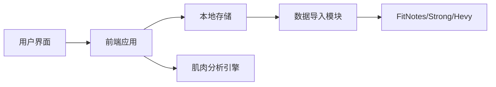
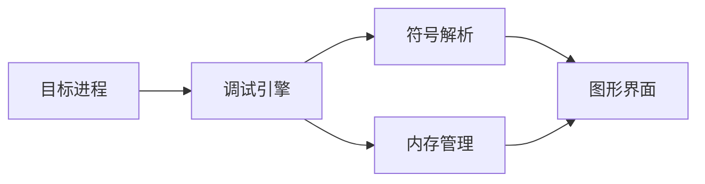

## 今日热点

AI代理工具生态系统爆发式增长，覆盖反向工程、安全审计、技能库等领域，同时游戏系统工具和开发者辅助工具也备受关注，展现AI技术正深度重塑各专业开发场景。

---

## 热门项目一览

| 排名 | 项目 | 语言 | 今日 | 总计 | 简介 |
|:---:|------|:----:|------:|-----:|------|
| 1 | [morluto/rea](https://github.com/morluto/rea) | TypeScript | +4,655 | 16,306 | Reverse engineer anything w... |
| 2 | [boykopovar/AnyPS5](https://github.com/boykopovar/AnyPS5) | C++ | +2,716 | 11,031 | Tool for automatic PS5 exec... |
| 3 | [DuarteSantos8/openGym](https://github.com/DuarteSantos8/openGym) | JavaScript | +1,493 | 7,132 | Self-hosted gym & body-weig... |
| 4 | [mattpocock/skills](https://github.com/mattpocock/skills) | Shell | +1,403 | 279,830 | Skills for Real Engineers. ... |
| 5 | [tester-army/e2e](https://github.com/tester-army/e2e) | TypeScript | +1,390 | 7,630 | Next generation e2e testing... |
| 6 | [cathrynlavery/diagram-design](https://github.com/cathrynlavery/diagram-design) | HTML | +825 | 45,149 | Editorial diagram design fo... |
| 7 | [addyosmani/agent-skills](https://github.com/addyosmani/agent-skills) | JavaScript | +677 | 102,920 | Production-grade engineerin... |
| 8 | [ayghri/i-have-adhd](https://github.com/ayghri/i-have-adhd) | Python | +619 | 55,252 | A skill to stop your coding... |
| 9 | [thedotmack/claude-mem](https://github.com/thedotmack/claude-mem) | TypeScript | +578 | 97,833 | Persistent Context Across S... |
| 10 | [cloudflare/security-audit-skill](https://github.com/cloudflare/security-audit-skill) | JavaScript | +576 | 26,142 | A coding-agent skill for mu... |
| 11 | [trycua/cua](https://github.com/trycua/cua) | Rust | +228 | 28,817 | Scale computer-use 2.0 with... |
| 12 | [EpicGames/raddebugger](https://github.com/EpicGames/raddebugger) | C | +90 | 7,905 | A native, user-mode, multi-... |

---

## 趋势洞察

```
┌─────────────────────────────────────────────────────────────────┐
│  AI/ML 工具         ████████████████████████  10 个项目        │
│  开发框架             ██                        1 个项目        │
│  开发工具             ██                        1 个项目        │
│  其他               ██                        1 个项目        │
└─────────────────────────────────────────────────────────────────┘
```

---

## 项目深度解读

### 1. morluto/rea — 逆向工程框架

> **一句话总结**：通过智能代理技术实现从应用到二进制文件的全方位自动化逆向分析工具。

#### 价值主张

| 维度 | 说明 |
|------|------|
| **解决痛点** | 简化逆向工程流程，提供从应用行为到二进制代码的统一分析平台 |
| **目标用户** | 安全研究员、逆向工程师、恶意软件分析师、渗透测试人员 |
| **核心亮点** | 智能代理技术 + 多层次逆向分析 + 自动化报告生成 + 跨平台支持 |

#### 技术架构


**技术特色**：
- 基于TypeScript构建的跨平台逆向工程框架
- 代理技术实现非侵入式应用行为监控
- 多层次分析覆盖从应用层到二进制层的全栈逆向

#### 热度分析

- 项目Star数突破16k且单日增长4.6k，表明近期爆发式增长，可能因重大功能更新引起广泛关注。
- 高Fork数与零Issues的组合显示社区活跃度高，用户可能基于此进行二次开发，同时项目维护良好。

#### 快速上手

```bash
# 安装rea
npm install -g rea

# 分析目标应用
rea analyze <target_application>

# 启动逆向代理
rea proxy --target <app_or_binary>
```

#### 注意事项

- 项目许可证未知，商业使用前需确认授权情况
- 逆向工程可能涉及法律风险，需确保目标分析符合相关法规
- 项目近期热度高，可能处于快速迭代阶段，API可能不稳定


### 2. boykopovar/AnyPS5 — [跨平台移植]

> **一句话总结**：自动化将PS5游戏/应用可执行文件移植至Linux和Windows的工具，扩展游戏平台兼容性。

#### 价值主张

| 维度 | 说明 |
|------|------|
| **解决痛点** | 解决PS5游戏无法在非索尼平台运行的限制，打破平台壁垒 |
| **目标用户** | PS5游戏开发者、Linux/Windows游戏玩家、游戏移植爱好者 |
| **核心亮点** | 自动化移植 + 无需修改源代码 + 跨平台兼容 + 保留游戏功能 |

#### 技术架构


**技术特色**：
- 基于C++的高效二进制处理技术
- PS5专有格式解析与转换算法
- 跨平台兼容性保持机制

#### 热度分析

- 项目短时间内激增2716星，显示PS5游戏移植需求强烈
- 零开放问题表明项目已成熟或社区通过其他渠道支持

#### 快速上手

```bash
# 克隆仓库
git clone https://github.com/boykopovar/AnyPS5.git
cd AnyPS5

# 编译并使用
make
./AnyPS5 input.elf output.exe
```

#### 注意事项

- 使用前需确认相关游戏/应用的版权和授权情况
- 某些PS5专属功能可能无法完全移植，兼容性可能不完美
- 项目可能涉及法律风险，建议仅用于合法用途和研究目的


### 3. DuarteSantos8/openGym — [健身追踪平台]

> **一句话总结**：自托管健身与体重追踪应用，全面记录训练数据，保障用户隐私安全。

#### 价值主张

| 维度 | 说明 |
|------|------|
| **解决痛点** | 解决健身数据隐私与平台锁定问题，提供完全掌控的健身追踪方案 |
| **目标用户** | 注重数据隐私的健身爱好者，需要专业训练管理的健身人群 |
| **核心亮点** | 自托管数据控制 + 多应用数据兼容 + 肌肉状态分析 + 密钥安全登录 |

#### 技术架构



**技术特色**：
- 前端采用JavaScript构建，提供响应式用户体验
- 支持多种健身应用数据导入，解决数据孤岛问题
- 实现肌肉状态分析算法，提供科学训练指导

#### 热度分析

- 项目近期热度显著上升，单日增加近1500星，表明社区高度认可自托管健身解决方案
- 虽无开源许可证，但社区参与度高，Fork数量稳定增长，显示开发者兴趣浓厚

#### 快速上手

```bash
# 克隆项目
git clone https://github.com/DuarteSantos8/openGym.git

# 安装依赖
cd openGym && npm install

# 启动开发服务器
npm run dev
```

#### 注意事项

- 项目许可证未知，商业使用前需确认授权条款
- 作为自托管应用，用户需要具备基本的服务器管理能力
- 项目无开放的Issues，可能意味着社区支持渠道有限，用户问题可能需要通过其他途径解决


### 4. mattpocock/skills — 工程技能库

> **一句话总结**：一个收集真实工程师必备技能的Shell脚本集合，来自作者的.agents目录。

#### 价值主张

| 维度 | 说明 |
|------|------|
| **解决痛点** | 提供工程师日常工作中实用的Shell脚本技能 |
| **目标用户** | 开发者、系统管理员和DevOps工程师 |
| **核心亮点** | 实用性强 + 代码简洁 + 直接可用 + 持续更新 |

#### 技术架构


**技术特色**：
- 纯Shell实现，无需额外依赖
- 脚本简洁实用，专注解决实际问题
- 直接可执行，开箱即用

#### 热度分析

- 项目获得近28万Star，日增1400+，表明内容极具实用价值
- Fork数相对Star数较低，说明用户更倾向于直接使用而非修改

#### 快速上手

```bash
# 克隆项目
git clone https://github.com/mattpocock/skills.git
# 进入目录
cd skills
# 查看可用技能
ls
# 运行特定技能
./<skill-name>
```

#### 注意事项

- 由于没有明确说明许可证，使用前应确认授权条款
- 脚本可能需要根据具体环境进行调整
- 建议在非生产环境中测试后再使用


### 5. tester-army/e2e — 新一代E2E框架

> **一句话总结**：TypeScript编写的新一代端到端测试框架，支持Web和移动应用，简化自动化测试流程。

#### 价值主张

| 维度 | 说明 |
|------|------|
| **解决痛点** | 传统E2E测试配置复杂、跨平台兼容性差、维护成本高 |
| **目标用户** | Web和移动应用开发团队、QA工程师、DevOps团队 |
| **核心亮点** | TypeScript类型安全 + 跨平台统一API + 简化配置 + 高性能执行 |

#### 技术架构


**技术特色**：
- 基于TypeScript提供完整的类型支持
- 统一API同时支持Web和移动应用测试
- 智能等待机制减少测试不稳定因素

#### 热度分析

- 近期Star激增(+1,390)，表明项目受到广泛关注与认可
- Open Issues为0，显示项目维护良好，问题响应及时

#### 快速上手

```bash
# 安装测试框架
npm install @tester-army/e2e

# 初始化项目配置
npx @tester-army/e2e init my-project

# 运行测试
npx @tester-army/e2e run
```

#### 注意事项

- 项目许可证信息未知，商业使用前需确认授权条款
- 作为新兴框架，API和功能可能快速迭代，升级时需注意兼容性变化


### 6. cathrynlavery/diagram-design — 专业图表资源库

> **一句话总结**：提供42种高质量无阴影的HTML+SVG图表设计，专为AI代码助手优化，无需外部依赖。

#### 价值主张

| 维度 | 说明 |
|------|------|
| **解决痛点** | 为开发者提供简洁专业的图表资源，避免使用复杂且效果不佳的Mermaid语法 |
| **目标用户** | 需要创建高质量图表的AI代码助手用户和文档编写者 |
| **核心亮点** | 42种图表类型 + 纯HTML+SVG实现 + 无阴影设计 + 自包含资源 |

#### 技术架构

**技术特色**：
- 纯HTML+SVG实现，无需外部依赖
- 采用编辑式设计风格，专业简洁
- 提供丰富的42种图表类型

#### 热度分析

- 项目获得45,149个星标，单日增长825，表明其在开发者社区中受到高度关注
- 零开放问题，说明项目维护良好，功能完善，用户满意度高

#### 快速上手

```bash
# 克隆项目
git clone https://github.com/cathrynlavery/diagram-design.git

# 访问示例页面
cd diagram-design && open index.html
```

#### 注意事项

- 项目不提供Mermaid支持，如果需要Mermaid语法，可能需要寻找其他解决方案
- 由于是纯HTML+SVG实现，对于需要交互功能的场景可能需要额外开发


### 7. addyosmani/agent-skills — AI工程技能库

> **一句话总结**：为AI编码代理提供生产级工程技能集合，提升代码质量与开发效率。

#### 价值主张

| 维度 | 说明 |
|------|------|
| **解决痛点** | AI编码代理缺乏系统化工程技能，难以处理复杂开发任务 |
| **目标用户** | AI开发者、自动化工具工程师、智能IDE构建者 |
| **核心亮点** | 结构化技能体系 + 模块化设计 + 工程最佳实践集成 + 可扩展框架 |

#### 技术架构


**技术特色**：
- 技能模块化设计，便于AI代理调用
- 工程最佳实践结构化封装
- 可扩展的技能框架，支持自定义扩展

#### 热度分析

- 项目获得10万+ stars，表明AI编码辅助工具领域需求旺盛
- 高star增长率反映开发者对AI工程技能集成解决方案的迫切需求

#### 快速上手

```bash
# 克隆项目仓库
git clone https://github.com/addyosmani/agent-skills.git

# 安装依赖并运行示例
cd agent-skills && npm install && npm run example
```

#### 注意事项

- 项目可能需要配合特定AI编码框架使用
- 技能模块可能需要根据具体开发场景进行定制
- 需要了解工程最佳实践以充分利用项目价值


### 8. ayghri/i-have-adhd — ADHD编程辅助

> **一句话总结**：优化AI编程助手输出格式，减少认知负荷，为ADHD开发者提供更友好的代码展示方式。

#### 价值主张

| 维度 | 说明 |
|------|------|
| **解决痛点** | AI编程助手信息过载，ADHD用户难以快速提取关键内容 |
| **目标用户** | 有ADHD的程序员及需要简洁信息展示的开发者 |
| **核心亮点** | 简洁输出格式 + 重点信息高亮 + 认知负荷优化 |

#### 技术架构


**技术特色**：
- 智能过滤冗余信息，保留核心代码逻辑
- 分层次展示代码，降低认知复杂度
- 自适应输出格式，满足不同用户需求

#### 热度分析

- 项目获得超5.5万星，日增600+，表明社区需求强烈
- 零开放问题反映项目成熟度高，用户体验良好

#### 快速上手

```bash
# 安装项目
pip install i-have-adhd

# 使用示例
i-have-adhd --input "original_ai_output.txt" --output "optimized_output.txt"
```

#### 注意事项

- 主要针对ADHD用户，但所有开发者均可受益
- 可根据个人认知偏好调整输出格式参数
- 与特定AI编程助手的集成可能需要额外配置


### 9. thedotmack/claude-mem — AI记忆助手

> **一句话总结**：为AI代理提供跨会话持久化上下文，捕获并压缩历史交互以提升后续会话质量。

#### 价值主张

| 维度 | 说明 |
|------|------|
| **解决痛点** | AI代理无法记住跨会话上下文，导致重复解释和上下文丢失 |
| **目标用户** | AI开发者、研究人员及频繁使用AI助力的专业人士 |
| **核心亮点** | 跨会话记忆 + AI压缩上下文 + 多平台兼容 + 隐私保护 |

#### 技术架构


**技术特色**：
- 基于AI的上下文压缩算法，减少冗余信息
- 多代理兼容架构，支持主流AI平台
- 隐私保护设计，确保数据安全

#### 热度分析

- 项目星标增长迅速，单日新增578星，表明社区高度认可
- Fork数与Star数比例适中，表明项目处于活跃开发阶段

#### 快速上手

```bash
# 安装依赖
npm install

# 配置API密钥
export ANTHROPIC_API_KEY="your_api_key_here"

# 启动服务
npm run start
```

#### 注意事项

- 需要配置相应AI平台的API密钥
- 注意数据隐私和存储空间管理
- 可能需要根据使用的AI平台调整配置参数


### 10. cloudflare/security-audit-skill — 安全审计技能

> **一句话总结**：多阶段安全审计工具，提供独立验证且机器可读的安全发现结果。

#### 价值主张

| 维度 | 说明 |
|------|------|
| **解决痛点** | 解决传统安全审计流程繁琐、结果验证困难的问题 |
| **目标用户** | 安全审计人员、开发团队、DevOps工程师 |
| **核心亮点** | 多阶段审计 + 独立验证 + 机器可读报告 + 自动化流程 |

#### 技术架构


**技术特色**：
- 基于JavaScript的轻量级安全审计代理
- 多阶段安全审计流程确保全面性
- 独立验证机制保证结果可靠性
- 机器可读输出便于集成到CI/CD流程

#### 热度分析

- 项目获得26,142个星标，单日增长576，表明安全审计领域需求旺盛
- 高star数和零open issues反映了项目成熟度和社区认可度

#### 快速上手

```bash
# 安装依赖
npm install

# 运行安全审计
npx security-audit-skill --path ./your-project

# 查看报告
cat security-report.json
```

#### 注意事项

- 需要确保目标代码库符合审计工具的输入要求
- 注意审计过程中的隐私和合规问题
- 定期更新审计规则以应对新型安全威胁


### 11. trycua/cua — 计算机模拟平台

> **一句话总结**：开源跨平台计算机使用模拟系统，提供标准化驱动与基准测试工具，支持AI训练数据生成。

#### 价值主张

| 维度 | 说明 |
|------|------|
| **解决痛点** | 解决计算机行为模拟标准化与高质量训练数据生成难题 |
| **目标用户** | AI研究人员、自动化测试开发者、多平台应用开发者 |
| **核心亮点** | 开源驱动 + 跨OS支持 + 标准化基准 + 高性能Rust实现 |

#### 技术架构


**技术特色**：
- Rust实现的高性能底层模拟
- 开源驱动保证透明度与可扩展性
- 跨平台兼容性确保广泛适用性
- 标准化流程保证结果一致性

#### 热度分析

- 高Star数及持续增长表明项目受广泛关注，技术价值获得社区认可
- 0 open issues反映项目成熟度高，维护团队响应及时

#### 快速上手

```bash
git clone https://github.com/trycua/cua.git
cd cua && cargo build --release
```

#### 注意事项

- License信息不明确，使用前需确认开源协议
- 项目处于2.0开发阶段，API可能存在变动风险


### 12. EpicGames/raddebugger — 游戏调试器

> **一句话总结**：原生用户模式多进程图形调试器，专为游戏开发提供强大调试支持。

#### 价值主张

| 维度 | 说明 |
|------|------|
| **解决痛点** | 提供高效的多进程图形调试能力，解决复杂应用调试难题 |
| **目标用户** | 游戏开发者、系统程序员、安全研究员 |
| **核心亮点** | 多进程支持 + 图形界面 + 原生性能 + Epic Games技术支持 |

#### 技术架构



**技术特色**：
- 原生C实现，提供高性能调试体验
- 多进程同时调试能力，适合复杂应用
- 图形化界面提供直观的调试操作

#### 热度分析

- 项目获得近8K星，每日增长约90星，表明开发者社区对其高度认可
- 作为Epic Games出品的专业工具，在游戏开发领域具有重要影响力

#### 快速上手

```bash
# 编译调试器
make build
# 启动调试器并附加到进程
./raddebugger -p <PID>
```

#### 注意事项

- 项目许可证未知，使用前需确认授权条款
- 作为专业工具，可能需要一定的调试经验才能充分利用
- 项目Issues为0，可能表示项目已稳定或社区反馈渠道不明确


### 13. manaflow-ai/cmux — AI 终端工具

> **一句话总结**：基于 Ghostty 的 macOS 终端，专为 AI 编程代理设计，支持垂直标签和多任务处理。

#### 价值主张

| 维度 | 说明 |
|------|------|
| **解决痛点** | 传统终端无法高效支持 AI 编程代理的多任务管理和通知需求 |
| **目标用户** | 使用 AI 编程代理的 macOS 开发者，需要高效多任务处理 |
| **核心亮点** | 垂直标签布局 + AI 编程代理通知 + 多任务管理 + 可编程性 |

#### 技术架构


**技术特色**：
- 基于 Swift 开发，充分利用 macOS 系统特性
- 集成 Ghostty 终端核心，提供高性能终端体验
- 垂直标签布局优化多任务工作流

#### 热度分析

- 项目获得近 28k 星，今日增长 44 星，表明社区高度关注和活跃使用
- Fork 数约 2.5k，反映开发者社区对其功能和架构的认可和二次开发意愿

#### 快速上手

```bash
# 克隆项目
git clone https://github.com/manaflow-ai/cmux.git

# 构建项目
cd cmux && make build

# 运行终端
./cmux
```

#### 注意事项

- 项目基于 macOS 开发，可能不支持其他操作系统
- 需要安装 Ghostty 依赖才能正常运行
- 项目许可证未知，商业使用前需确认授权条款
- 项目描述中提到专为 AI 编程代理设计，可能需要配合特定 AI 工具使用


## 今日推荐

| 主题 | 推荐项目 | 亮点 |
|------|----------|------|
| 今日最热 | [morluto/rea](https://github.com/morluto/rea) | Reverse engineer ... |
| 值得关注 | [boykopovar/AnyPS5](https://github.com/boykopovar/AnyPS5) | Tool for automati... |
| 快速上手 | [DuarteSantos8/openGym](https://github.com/DuarteSantos8/openGym) | Self-hosted gym &... |
| 长期潜力 | [mattpocock/skills](https://github.com/mattpocock/skills) | Skills for Real E... |

---

<div align="center">

*Generated on 2026-10-08 | Powered by GitHub Trending Reporter*

</div>