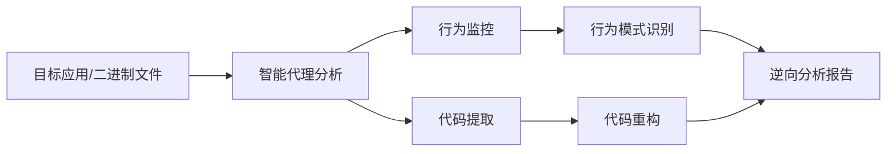
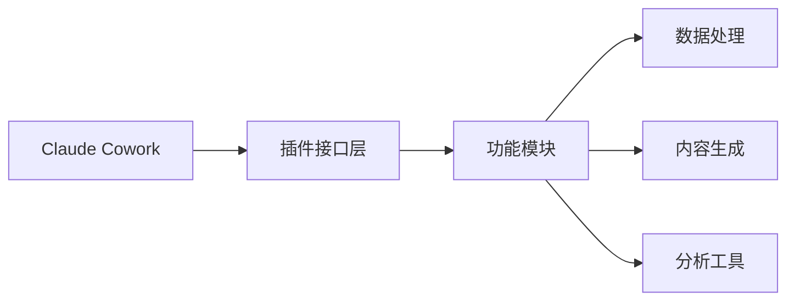
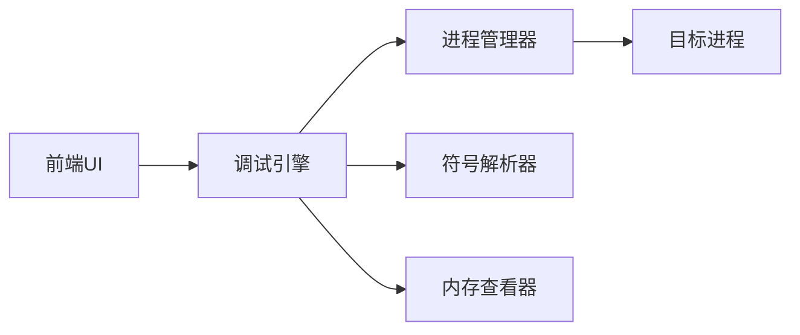

## 今日热点

今日GitHub热榜显示AI代理工具链爆发式增长，同时游戏跨平台解决方案和开发效率工具备受关注，反映出AI辅助编程和跨平台技术成为当前技术热点。

---

## 热门项目一览

| 排名 | 项目 | 语言 | 今日 | 总计 | 简介 |
|:---:|------|:----:|------:|-----:|------|
| 1 | [morluto/rea](https://github.com/morluto/rea) | TypeScript | +7,738 | 28,940 | Reverse engineer anything w... |
| 2 | [boykopovar/AnyPS5](https://github.com/boykopovar/AnyPS5) | C++ | +4,669 | 16,364 | Tool for automatic PS5 exec... |
| 3 | [storytold/artcraft](https://github.com/storytold/artcraft) | Rust | +2,103 | 8,405 | ArtCraft is an intentional ... |
| 4 | [mattpocock/skills](https://github.com/mattpocock/skills) | Shell | +1,774 | 281,308 | Skills for Real Engineers. ... |
| 5 | [cathrynlavery/diagram-design](https://github.com/cathrynlavery/diagram-design) | HTML | +1,160 | 46,621 | Editorial diagram design fo... |
| 6 | [thedotmack/claude-mem](https://github.com/thedotmack/claude-mem) | TypeScript | +670 | 98,605 | Persistent Context Across S... |
| 7 | [liquidslr/system-design-notes](https://github.com/liquidslr/system-design-notes) | Unknown | +393 | 24,781 | Notes of the book System De... |
| 8 | [anthropics/knowledge-work-plugins](https://github.com/anthropics/knowledge-work-plugins) | Python | +392 | 27,719 | Open source repository of p... |
| 9 | [EpicGames/raddebugger](https://github.com/EpicGames/raddebugger) | C | +279 | 8,155 | A native, user-mode, multi-... |

---

## 趋势洞察

```
┌─────────────────────────────────────────────────────────────────┐
│  AI/ML 工具         ████████████████████████  5 个项目        │
│  其他               ██████████████            3 个项目        │
│  开发工具             ████                      1 个项目        │
└─────────────────────────────────────────────────────────────────┘
```

---

## 项目深度解读

### 1. morluto/rea — 逆向工程框架

> **一句话总结**：通过智能代理技术实现从应用程序行为到原生二进制文件的全面逆向工程。

#### 价值主张

| 维度 | 说明 |
|------|------|
| **解决痛点** | 提供一站式解决方案，解决逆向工程中复杂性和技术门槛高的问题 |
| **目标用户** | 安全研究员、逆向工程师、恶意软件分析师 |
| **核心亮点** | 智能代理技术 + 跨平台支持 + 自动化逆向分析 + 二进制到应用层全覆盖 |

#### 技术架构



**技术特色**：
- 基于TypeScript开发，确保跨平台兼容性和类型安全
- 使用智能代理技术实现自动化逆向分析
- 支持从二进制到应用层的全栈逆向工程

#### 热度分析

- 项目在短时间内获得大量关注，单日增长超过7,700 stars，表明逆向工程领域有强烈需求
- Fork数相对stars比例较低，可能表明项目处于早期阶段，社区贡献尚未形成规模

#### 快速上手

```bash
# 安装rea
npm install -g rea

# 分析二进制文件
rea analyze /path/to/binary

# 分析应用程序行为
rea monitor /path/to/application
```

#### 注意事项

- 逆向工程可能涉及法律风险，请确保在合法合规范围内使用
- 项目可能需要较高的技术背景才能充分利用其功能
- 由于项目描述较为简短，实际使用前建议查阅详细文档


### 2. boykopovar/AnyPS5 — PS5游戏移植工具

> **一句话总结**：一款自动将PS5游戏可执行文件转换为Linux和Windows平台的跨平台移植工具。

#### 价值主张

| 维度 | 说明 |
|------|------|
| **解决痛点** | 解决PS5游戏无法在PC等非索尼平台运行的限制 |
| **目标用户** | Linux/Windows平台上的PS5游戏爱好者与开发者 |
| **核心亮点** | 自动化移植流程 + 无需修改原游戏代码 + 跨平台兼容性 |

#### 技术架构


**技术特色**：
- 自动识别和转换PS5特定系统API调用
- 处理游戏引擎与底层系统依赖关系
- 保持游戏性能与功能完整性

#### 热度分析

- 项目近期获得大量关注，单日增长4,669个Star，显示游戏移植需求旺盛
- 在开源游戏社区中具有重要影响力，推动游戏跨平台发展

#### 快速上手

```bash
git clone https://github.com/boykopovar/AnyPS5.git
cd AnyPS5
./anyps5 /path/to/ps5/game
```

#### 注意事项

- 此工具可能涉及版权和法律问题，请确保遵守相关法律法规
- 游戏移植后可能出现兼容性问题或性能损失，建议备份原游戏文件


### 3. storytold/artcraft — 创意制作引擎

> **一句话总结**：ArtCraft是艺术家、设计师和电影制作人的专业创意制作引擎，提供统一高效的数字创作工具链。

#### 价值主张

| 维度 | 说明 |
|------|------|
| **解决痛点** | 打破创意工具壁垒，提供跨媒介统一创作平台 |
| **目标用户** | 艺术家、设计师、电影制作人等创意工作者 |
| **核心亮点** | 高性能渲染 + 模块化设计 + 跨平台支持 + 专业级工具集 |

#### 技术架构


**技术特色**：
- 基于Rust构建，提供高性能与内存安全保证
- 模块化架构设计，支持插件扩展与自定义工具链
- 跨平台兼容，无缝衔接工作流

#### 热度分析

- 项目近期热度激增，单日增长2,103个Star，表明创意工具领域需求旺盛
- Fork数1,210，显示开发者社区参与度高，二次开发意愿强烈

#### 快速上手

```bash
# 克隆仓库
git clone https://github.com/storytold/artcraft.git

# 构建项目
cd artcraft
cargo build --release
```

#### 注意事项

- 项目许可证信息未知，商业使用前需确认授权条款
- 作为专业创意工具，可能需要一定学习曲线才能充分利用功能


### 4. mattpocock/skills — 工程师技能库

> **一句话总结**：精选Shell脚本技能集，为工程师提供可直接使用的自动化工具和最佳实践。

#### 价值主张

| 维度 | 说明 |
|------|------|
| **解决痛点** | 消除重复劳动，提供即插即用的Shell脚本解决方案 |
| **目标用户** | 开发者、系统管理员、DevOps工程师 |
| **核心亮点** | 实用性强 + 即插即用 + 质量保证 + 持续更新 |

#### 技术架构

由于这是一个Shell脚本集合项目，没有明确的技术流程，因此省略mermaid图部分。

**技术特色**：
- 纯Shell实现，无需额外依赖，开箱即用
- 模块化设计，每个脚本专注解决特定问题
- 注重代码质量和可维护性，遵循Shell最佳实践

#### 热度分析

- 项目获得28万+星，日增1.7k+，表明工程师群体对实用Shell脚本有强烈需求
- Fork数与Star数比例约为8.4%，社区积极参与贡献和二次开发

#### 快速上手

```bash
# 克隆项目到本地
git clone https://github.com/mattpocock/skills.git

# 查看可用技能
cd skills && ls
```

#### 注意事项
- 项目使用Shell脚本，需确保系统有相应Shell环境支持
- 某些脚本可能需要额外依赖，使用前请检查README中的说明
- 建议在使用前熟悉每个脚本的功能，避免误用


### 5. cathrynlavery/diagram-design — 专业图表设计库

> **一句话总结**：自包含HTML+SVG图表库，提供42种无阴影专业编辑风格图表，专为AI编程工具设计。

#### 价值主张

| 维度 | 说明 |
|------|------|
| **解决痛点** | 解决AI工具和编程文档中缺乏高质量、简洁专业图表的问题，摆脱Mermaid局限性 |
| **目标用户** | 开发者、技术文档撰写者、AI工具使用者、技术内容创作者 |
| **核心亮点** | 42种专业图表类型 + 纯HTML+SVG实现 + 无阴影设计 + 自包含单文件 + 专为AI编程工具定制 |

#### 技术架构


**技术特色**：
- 纯HTML+SVG实现，无需额外依赖
- 自包含单文件，易于集成和部署
- 专业的编辑风格设计，无阴影效果

#### 热度分析

- 项目获得46,621个星标且近期增长迅速(+1,160)，表明技术社区对高质量图表设计有强烈需求
- 作为开源图表资源，已成为技术文档和AI工具生态中的重要组成部分

#### 快速上手

```bash
# 克隆仓库
git clone https://github.com/cathrynlavery/diagram-design.git

# 在浏览器中打开index.html查看所有图表类型
# 复制需要的图表HTML代码到你的项目中
```

#### 注意事项

- 项目使用自定义的HTML+SVG实现，而非Mermaid等标准图表工具
- 所有图表均为无阴影的编辑风格设计，适合专业文档使用
- 需要一定的HTML和SVG知识才能进行深度定制


### 6. thedotmack/claude-mem — AI上下文记忆

> **一句话总结**：为AI助手提供跨会话持久化记忆，智能压缩并注入相关上下文。

#### 价值主张

| 维度 | 说明 |
|------|------|
| **解决痛点** | 解决AI助手无法在多次会话间保持长期记忆和上下文连贯性问题 |
| **目标用户** | 使用AI编程助手(Claude、Copilot等)的开发者和研究人员 |
| **核心亮点** | 跨会话记忆持久化 + AI压缩上下文 + 多AI助手兼容 + 自动化上下文注入 |

#### 技术架构


**技术特色**：
- 跨AI平台的通用兼容性设计
- AI驱动的上下文压缩与优化
- 无缝的会话间记忆传递机制
- 高效的上下文检索和注入系统

#### 热度分析

- 项目获近10万星，单日增长600+，显示极强的市场需求和社区认可度
- 作为AI辅助编程工具生态中的重要组件，处于快速增长阶段

#### 快速上手

```bash
# 安装
npm install -g claude-mem

# 初始化
claude-mem init

# 启动会话
claude-mem start
```

#### 注意事项

- 需要与特定的AI助手集成才能正常工作
- 上下文存储需考虑隐私和数据安全问题
- 长期使用可能需要定期清理或优化存储空间


### 7. liquidslr/system-design-notes — 系统设计面试指南

> **一句话总结**：一本系统设计面试书籍的精华笔记，覆盖核心概念与实战案例，助力工程师攻克面试难关。

#### 价值主张

| 维度 | 说明 |
|------|------|
| **解决痛点** | 提供系统化系统设计面试知识体系，解决工程师面试准备无章法问题 |
| **目标用户** | 准备系统设计面试的软件工程师、技术面试官 |
| **核心亮点** | 实战案例 + 知识体系 + 常见问题解析 + 设计模式 + 最佳实践 |

#### 技术架构


**技术特色**：
- 结构化呈现系统设计知识体系
- 结合真实场景的案例分析
- 面试常见问题与解决方案

#### 热度分析

- Star持续稳定增长，日增近400个Star，表明项目在技术社区影响力持续扩大
- 高参与度社区，Fork与Star比例达1:5，用户不仅收藏还积极贡献内容

#### 快速上手

```bash
# 克隆项目到本地
git clone https://github.com/liquidslr/system-design-notes.git

# 使用浏览器打开阅读
cd system-design-notes && index.html
```

#### 注意事项

- 笔记内容基于《System Design Interview - An Insider's Guide》一书，建议结合原书一起学习
- 系统设计领域技术更新快，需持续关注最新技术趋势和面试重点
- 笔记内容偏重概念理解，建议结合实际项目经验深化理解


### 8. anthropics/knowledge-work-plugins — AI助手插件集

> **一句话总结**：Anthropic 开发的 Claude Cowork 专业插件库，扩展知识工作场景下的AI应用能力。

#### 价值主张

| 维度 | 说明 |
|------|------|
| **解决痛点** | 为 Claude AI 提供专业化插件，解决知识工作场景中的功能局限 |
| **目标用户** | 知识工作者、研究人员、内容创作者、专业分析师 |
| **核心亮点** | 专业领域插件 + 工作流程集成 + 任务自动化 + 知识管理 |

#### 技术架构



**技术特色**：
- 基于 Python 的模块化插件架构，便于功能扩展
- 标准化的插件接口设计，确保与 Claude AI 无缝集成
- 支持多种知识工作场景的专用工具集

#### 热度分析

- 项目获得近2.8万星，近期增长迅速，反映知识工作者对AI辅助工具的高需求
- 作为 Anthropic 官方插件库，在AI辅助知识工作领域具有生态引领地位

#### 快速上手

```bash
# 克隆仓库
git clone https://github.com/anthropics/knowledge-work-plugins.git

# 安装依赖
cd knowledge-work-plugins
pip install -r requirements.txt
```

#### 注意事项

- 插件需要 Claude Cowork 环境才能正常运行
- 部分插件可能需要 API 密钥或额外配置
- 插件功能与 Claude AI 的版本更新可能存在兼容性问题


### 9. EpicGames/raddebugger — 多进程图形调试器

> **一句话总结**：Epic Games开发的原生用户模式多进程图形调试器，提供强大的程序调试能力。

#### 价值主张

| 维度 | 说明 |
|------|------|
| **解决痛点** | 解决复杂多进程应用程序调试难题，提供直观图形界面 |
| **目标用户** | 游戏开发者、系统程序员、安全研究员 |
| **核心亮点** | 多进程支持 + 图形界面 + 原生性能 + 跨平台支持 + Epic技术背书 |

#### 技术架构



**技术特色**：
- 基于原生C实现，提供高性能调试体验
- 支持多进程同时调试，适合复杂应用场景
- 图形化界面简化调试操作，提高效率

#### 热度分析

- 项目获得8,155个星，单日增长279，表明其在开发者社区中热度持续上升
- 由Epic Games开发，作为Unreal引擎配套工具，具有稳定的技术支持和社区生态

#### 快速上手

```bash
# 克隆项目
git clone https://github.com/EpicGames/raddebugger.git
# 构建项目
cd raddebugger
mkdir build && cd build
cmake ..
make
# 运行调试器
./raddebugger
```

#### 注意事项

- 项目许可证未知，商业使用前需确认授权情况
- 作为Epic Games内部工具，可能存在未公开的依赖或特殊构建要求
- 主要针对Windows平台开发，跨平台支持可能有限


## 今日推荐

| 主题 | 推荐项目 | 亮点 |
|------|----------|------|
| 今日最热 | [morluto/rea](https://github.com/morluto/rea) | Reverse engineer ... |
| 值得关注 | [boykopovar/AnyPS5](https://github.com/boykopovar/AnyPS5) | Tool for automati... |
| 快速上手 | [storytold/artcraft](https://github.com/storytold/artcraft) | ArtCraft is an in... |
| 长期潜力 | [mattpocock/skills](https://github.com/mattpocock/skills) | Skills for Real E... |

---

<div align="center">

*Generated on 2026-10-09 | Powered by GitHub Trending Reporter*

</div>