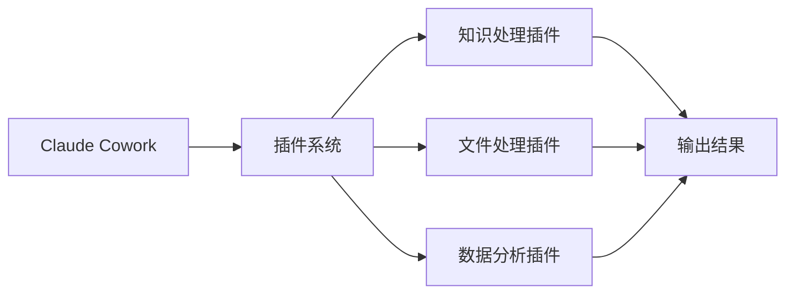
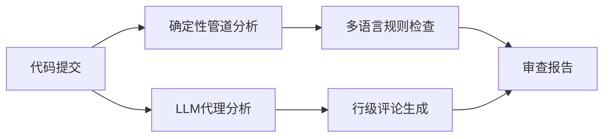
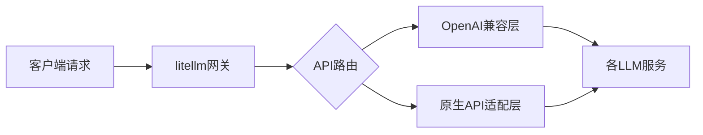

## 今日热点

今日GitHub热榜主要呈现两大趋势：一是AI代理技能与工具的爆发式增长，涵盖代码助手、知识工作插件和反向工程等领域；二是跨平台开发工具的持续热度，特别是在游戏移植和3D重建技术方面。

---

## 热门项目一览

| 排名 | 项目 | 语言 | 今日 | 总计 | 简介 |
|:---:|------|:----:|------:|-----:|------|
| 1 | [morluto/rea](https://github.com/morluto/rea) | TypeScript | +14,927 | 49,927 | Reverse engineer anything w... |
| 2 | [boykopovar/AnyPS5](https://github.com/boykopovar/AnyPS5) | C++ | +5,868 | 22,810 | Tool for automatic PS5 exec... |
| 3 | [storytold/artcraft](https://github.com/storytold/artcraft) | Rust | +3,752 | 11,837 | ArtCraft is an intentional ... |
| 4 | [cathrynlavery/diagram-design](https://github.com/cathrynlavery/diagram-design) | HTML | +1,739 | 48,047 | Editorial diagram design fo... |
| 5 | [mattpocock/skills](https://github.com/mattpocock/skills) | Shell | +1,687 | 282,923 | Skills for Real Engineers. ... |
| 6 | [anthropics/knowledge-work-plugins](https://github.com/anthropics/knowledge-work-plugins) | Python | +709 | 28,333 | Open source repository of p... |
| 7 | [addyosmani/agent-skills](https://github.com/addyosmani/agent-skills) | JavaScript | +436 | 104,077 | Production-grade engineerin... |
| 8 | [alibaba/open-code-review](https://github.com/alibaba/open-code-review) | Go | +326 | 45,369 | Secure, fast, efficient, ba... |
| 9 | [Robbyant/lingbot-map](https://github.com/Robbyant/lingbot-map) | Python | +110 | 17,764 | [ECCV 2026 Best Paper Award... |
| 10 | [BerriAI/litellm](https://github.com/BerriAI/litellm) | Python | +95 | 60,718 | The fastest, litest AI Gate... |
| 11 | [twostraws/SwiftUI-Agent-Skill](https://github.com/twostraws/SwiftUI-Agent-Skill) | Unknown | +65 | 5,509 | SwiftUI agent skill for Cla... |

---

## 趋势洞察

```
┌─────────────────────────────────────────────────────────────────┐
│  AI/ML 工具         ████████████████████████  8 个项目        │
│  媒体资源             ███                       1 个项目        │
│  开发工具             ███                       1 个项目        │
│  其他               ███                       1 个项目        │
└─────────────────────────────────────────────────────────────────┘
```

---

## 项目深度解读

### 1. morluto/rea — 逆向工程工具

> **一句话总结**：基于代理技术的全方位逆向工程工具，可分析应用行为至原生二进制文件。

#### 价值主张

| 维度 | 说明 |
|------|------|
| **解决痛点** | 简化复杂软件的逆向分析流程，降低技术门槛 |
| **目标用户** | 安全研究员、逆向工程师、软件开发者 |
| **核心亮点** | 多平台支持+智能行为分析+自动化逆向流程+详细报告生成 |

#### 技术架构


**技术特色**：
- 基于TypeScript开发，跨平台兼容性强
- 使用代理技术实现非侵入式分析
- 自动化逆向流程，减少人工操作

#### 热度分析

- 项目近期Star激增(+14,927 today)，表明受到广泛关注
- 零Open Issues显示项目成熟度高，维护良好

#### 快速上手

```bash
# 安装REA
npm install -g rea

# 分析目标程序
rea analyze /path/to/target

# 生成逆向报告
rea report --format pdf
```

#### 注意事项

- 逆向工程可能涉及法律问题，需确保合法合规使用
- 某些软件可能有反逆向工程机制，需要额外处理
- 复杂二进制文件可能需要长时间分析


### 2. boykopovar/AnyPS5 — PS5移植工具

> **一句话总结**：AnyPS5是自动化将PS5游戏和应用程序移植到Linux和Windows平台的工具。

#### 价值主张

| 维度 | 说明 |
|------|------|
| **解决痛点** | PS5游戏缺乏原生跨平台支持，限制了用户选择和开发者覆盖范围 |
| **目标用户** | PS5游戏玩家、独立开发者、游戏移植工程师 |
| **核心亮点** | 自动化逆向分析 + 系统调用转换 + 无需修改原始代码 |

#### 技术架构


**技术特色**：
- 利用逆向工程技术解析PS5二进制文件结构
- 实现系统调用层和图形API的抽象转换
- 处理PS5特有的硬件抽象和系统服务接口

#### 热度分析

- 项目单日增长近6k星标，总星数超22k，表明游戏社区对跨平台工具有极高需求
- 作为填补PS5游戏移植空白的前沿工具，吸引了大量开发者和游戏爱好者关注

#### 快速上手

```bash
# 克隆项目仓库
git clone https://github.com/boykopovar/AnyPS5.git
# 构建工具
cd AnyPS5 && make
# 执行移植
./anyps5 /path/to/ps5/game
```

#### 注意事项

- 使用前需确保拥有相关游戏的合法权限，避免版权问题
- 移植后的游戏可能无法完全达到原始PS5的性能和兼容性
- 工具可能需要不断更新以适应PS5系统更新和新游戏发行
- 许可证信息未知，使用前应确认开源协议条款


### 3. storytold/artcraft — 创意引擎

> **一句话总结**：为创意专业人士提供一体化创作工具链，实现高效跨媒体内容创作。

#### 价值主张

| 维度 | 说明 |
|------|------|
| **解决痛点** | 整合分散的创作工具，提供统一高效的创意工作环境 |
| **目标用户** | 艺术家、设计师和电影制作人等创意专业人士 |
| **核心亮点** | 跨媒体创作支持 + 模块化设计 + 高性能处理 + 创意资产管理 |

#### 技术架构


**技术特色**：
- 基于Rust构建，确保高性能和内存安全
- 采用模块化架构，支持灵活扩展和


### 4. cathrynlavery/diagram-design — 专业图表设计库

> **一句话总结**：高质量自包含HTML+SVG图表库，提供42种专业图表类型，无需依赖。

#### 价值主张

| 维度 | 说明 |
|------|------|
| **解决痛点** | 提供专业、简洁、无依赖的图表解决方案，替代Mermaid等工具 |
| **目标用户** | 需要高质量图表的设计师、开发者和技术文档撰写者 |
| **核心亮点** | 42种图表类型 + 自包含HTML+SVG实现 + 无阴影设计 + 简洁风格 |

#### 技术架构


**技术特色**：
- 纯HTML+SVG实现，无需外部依赖
- 42种预设图表类型，覆盖常见需求
- 简洁设计风格，无多余装饰元素

#### 热度分析

- 项目获得48,047个Star，近期增长1,739，显示强劲社区支持和技术认可度
- 作为纯前端图表解决方案，在技术文档和设计领域占据独特生态位置

#### 快速上手

```bash
# 直接克隆项目
git clone https://github.com/cathrynlavery/diagram-design.git

# 在浏览器中打开index.html
# 或将所需的SVG代码复制到你的项目中
```

#### 注意事项

- 项目没有明确许可证，商业使用前需确认授权
- 作为纯前端解决方案，可能不适合需要服务器端渲染的场景
- 图表风格偏向简洁，可能不适合所有设计需求


### 5. mattpocock/skills — 工程师技能库

> **一句话总结**：实用Shell脚本集合，提供工程师日常工作所需的高效工具和自动化解决方案。

#### 价值主张

| 维度 | 说明 |
|------|------|
| **解决痛点** | 消除重复性工作，提供现成脚本提升开发效率 |
| **目标用户** | 开发者、系统管理员和DevOps工程师 |
| **核心亮点** | 即插即用 + 高度实用 + 持续更新 + 跨平台兼容 + 最佳实践集成 |

#### 技术架构


**技术特色**：
- 纯Shell实现，无需复杂依赖，开箱即用
- 模块化设计，各脚本功能独立且可组合
- 遵循Unix哲学，单一职责，易于理解和修改

#### 热度分析

- 28万+星标，日增1.6k+，在工具类项目中增长迅猛
- 无开放问题，表明项目维护良好，用户反馈积极

#### 快速上手

```bash
# 克隆仓库
git clone https://github.com/mattpocock/skills.git

# 进入目录
cd skills

# 查看可用脚本
ls -la scripts
```

#### 注意事项

- 使用前建议阅读脚本内容，确保符合安全要求
- 根据个人环境可能需要调整脚本参数或路径
- 项目持续更新，建议定期同步获取最新功能


### 6. anthropics/knowledge-work-plugins — AI知识插件库

> **一句话总结**：Anthropic官方开发的知识工作插件库，扩展Claude Cowork功能，提升专业任务处理效率。

#### 价值主张

| 维度 | 说明 |
|------|------|
| **解决痛点** | 为知识工作者提供专业工具，增强AI处理复杂任务能力 |
| **目标用户** | 知识工作者、研究人员、内容创作者、数据分析人员 |
| **核心亮点** | 官方支持 + 专业知识处理 + 任务扩展 + 提高效率 |

#### 技术架构



**技术特色**：
- 模块化插件架构，易于扩展和定制
- 与Claude AI深度集成，提供无缝工作流
- 专为知识工作场景优化的功能设计

#### 热度分析

- 项目获得28,333个Star，近期增长迅速，显示AI辅助知识工作工具需求旺盛
- 作为Anthropic官方项目，在AI辅助工作领域具有重要生态地位

#### 快速上手

```bash
# 克隆仓库
git clone https://github.com/anthropics/knowledge-work-plugins.git

# 安装依赖
cd knowledge-work-plugins
pip install -r requirements.txt
```

#### 注意事项

- 需要安装Claude Cowork才能使用这些插件
- 插件可能需要特定的API密钥或配置才能正常工作
- 部分插件可能需要额外的Python库支持


### 7. addyosmani/agent-skills — AI工程技能库

> **一句话总结**：为AI编码代理提供生产级工程技能的综合性技能库。

#### 价值主张

| 维度 | 说明 |
|------|------|
| **解决痛点** | 提升AI代码代理的工程能力和代码质量 |
| **目标用户** | AI开发人员、AI系统工程师、AI研究员 |
| **核心亮点** | 生产级技能库 + 实用工程方法 + 最佳实践集 |

#### 技术架构

**技术特色**：
- 采用JavaScript实现，易于集成到各类AI系统
- 模块化设计，支持灵活组合使用
- 提供工程化最佳实践和代码优化技巧

#### 热度分析

- 高星项目持续增长，日均新增436星，热度极高
- 生态位置重要，为AI编码领域提供基础技能支持

#### 快速上手

```bash
# 克隆项目
git clone https://github.com/addyosmani/agent-skills.git

# 安装依赖
cd agent-skills
npm install
```

#### 注意事项

- 项目许可证未知，商业使用前需确认授权条款
- 项目可能需要与特定AI框架配合使用才能发挥最大效用


### 8. alibaba/open-code-review — 智能代码审查

> **一句话总结**：结合确定性管道与LLM代理的高效代码审查工具，提供精准行级评论与多语言安全检测。

#### 价值主张

| 维度 | 说明 |
|------|------|
| **解决痛点** | 解决传统代码审查效率低、质量不一致问题，大规模代码库安全漏洞检测 |
| **目标用户** | 需要高质量代码审查的企业团队，尤其是大规模代码库管理者 |
| **核心亮点** | 混合架构确定性管道+LLM代理 + 精确行级评论 + 多语言内置安全规则集 |

#### 技术架构



**技术特色**：
- 混合架构结合确定性与AI分析
- 支持多种编程语言的安全规则检测
- 兼容OpenAI和Anthropic的LLM接口

#### 热度分析

- 项目获45k+ Star且日增326+，增长迅猛，受开发者高度认可
- 作为阿里巴巴开源的企业级工具，在DevOps和代码质量保障领域具有重要生态位置

#### 快速上手

```bash
# 克隆项目
git clone https://github.com/alibaba/open-code-review.git
cd open-code-review

# 安装依赖
go mod download

# 运行代码审查
./open-code-review --path=/path/to/code
```

#### 注意事项

- 项目许可证信息未知，使用前需要确认
- 需要配置OpenAI或Anthropic的API密钥才能使用LLM功能
- 项目可能需要一定的Go语言知识才能进行定制和扩展


### 9. Robbyant/lingbot-map — 3D重建工具

> **一句话总结**：基于几何上下文Transformer的流式3D重建工具，实现高效实时三维场景构建。

#### 价值主张

| 维度 | 说明 |
|------|------|
| **解决痛点** | 传统3D重建方法在实时性和几何精度上的局限性 |
| **目标用户** | 计算机视觉研究者、机器人开发者、AR/VR应用开发者 |
| **核心亮点** | 几何上下文Transformer架构 + 流式处理能力 + 高精度重建 + 实时性能 + ECCV顶级论文背书 |

#### 技术架构


**技术特色**：
- 几何上下文Transformer架构，提升空间理解能力
- 流式处理设计，支持实时3D场景重建
- 高效特征提取与融合算法，平衡精度与性能

#### 热度分析

- 高星项目(17k+)持续增长(+110/天)，显示学术界与工业界高度关注
- 零开放问题表明项目成熟度高，社区维护良好

#### 快速上手

```bash
# 克隆项目
git clone https://github.com/Robbyant/lingbot-map.git

# 安装依赖
cd lingbot-map
pip install -r requirements.txt

# 运行示例
python demo.py
```

#### 注意事项

- 项目需要较强的计算机视觉和3D重建知识背景
- 可能需要高性能GPU设备以获得最佳性能
- 注意项目许可证信息，确保合规使用


### 10. BerriAI/litellm — AI统一网关

> **一句话总结**：轻量级AI网关，统一调用100+大模型API，提供成本跟踪和安全防护。

#### 价值主张

| 维度 | 说明 |
|------|------|
| **解决痛点** | 解决多LLM API调用碎片化，统一接口降低集成复杂度 |
| **目标用户** | 需要集成多种AI模型的企业开发者和AI应用团队 |
| **核心亮点** | 统一接口 + 成本跟踪 + 安全防护 + 负载均衡 + 日志记录 |

#### 技术架构



**技术特色**：
- Rust核心提供高性能和内存安全
- Python SDK简化集成和开发流程
- 统一接口抽象底层差异
- 内置成本跟踪和负载均衡机制

#### 热度分析

- 项目Star数超6万，日增近百星，增长迅速，表明社区认可度高
- 作为AI基础设施层项目，处于AI应用生态的关键位置，具有广泛影响力

#### 快速上手

```bash
# 安装litellm
pip install litellm

# 基本使用示例
import litellm
response = litellm.completion(
    model="gpt-3.5-turbo",
    messages=[{"role": "user", "content": "Hello world"}]
)
```

#### 注意事项

- 需要为每个使用的LLM API配置相应的API密钥和访问权限
- 不同模型可能有不同的参数限制和特性，需要查阅相应文档
- 高并发场景可能需要配置负载均衡和资源限制以控制成本


### 11. twostraws/SwiftUI-Agent-Skill — [AI辅助开发]

> **一句话总结**：为AI编程助手提供SwiftUI专业知识，提升开发效率与代码质量。

#### 价值主张

| 维度 | 说明 |
|------|------|
| **解决痛点** | 解决AI工具缺乏SwiftUI专业知识的问题 |
| **目标用户** | Swift开发者、AI辅助编程使用者 |
| **核心亮点** | 专业SwiftUI知识库 + AI工具集成 + 代码优化建议 |

#### 技术架构

由于项目描述较为简单，且没有明确的技术流程，我将省略mermaid图部分。

**技术特色**：
- 基于Paul Hudson的SwiftUI专业知识构建
- 针对AI工具优化的提示工程
- 提供高质量的SwiftUI代码示例

#### 热度分析

- 项目获得5500+星标且持续增长，显示开发者对AI辅助编程工具的强烈需求
- 作为知名技术专家创建的项目，在Swift社区具有较高影响力

#### 快速上手

```bash
# 克隆项目
git clone https://github.com/twostraws/SwiftUI-Agent-Skill.git

# 查看使用说明
cat README.md
```

#### 注意事项

- 需要配合支持Claude Code或Codex等AI工具使用
- 项目可能需要定期更新以适应SwiftUI和AI工具的最新发展


## 今日推荐

| 主题 | 推荐项目 | 亮点 |
|------|----------|------|
| 今日最热 | [morluto/rea](https://github.com/morluto/rea) | Reverse engineer ... |
| 值得关注 | [boykopovar/AnyPS5](https://github.com/boykopovar/AnyPS5) | Tool for automati... |
| 快速上手 | [storytold/artcraft](https://github.com/storytold/artcraft) | ArtCraft is an in... |
| 长期潜力 | [cathrynlavery/diagram-design](https://github.com/cathrynlavery/diagram-design) | Editorial diagram... |

---

<div align="center">

*Generated on 2026-10-10 | Powered by GitHub Trending Reporter*

</div>